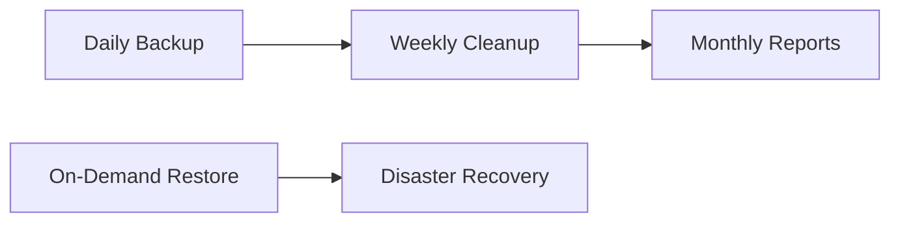

# Microsoft Fabric Lakehouse Backup Solution

A comprehensive backup, restore, and cleanup solution for Microsoft Fabric Lakehouses with full scheduling capabilities and automated retention management.

## 📋 Overview

This solution provides enterprise-grade automated backup capabilities for Microsoft Fabric Lakehouses with the following features:

- **Full backup** of all Delta tables in a Lakehouse
- **Configurable destinations** (Azure Storage Account, another Lakehouse, ADLS)
- **Metadata preservation** including Delta transaction logs
- **Backup verification** with row count validation
- **Automated cleanup** with intelligent retention policies
- **Detailed logging** and comprehensive reporting
- **Scheduled execution** support via multiple methods
- **Cross-workspace operations** via OneLake integration

## 📁 Files Included

1. **`README.md`** - This comprehensive documentation
2. **`Fabric_Lakehouse_Backup.ipynb`** - Main backup notebook
3. **`Fabric_Lakehouse_Restore.ipynb`** - Restore notebook for recovery operations
4. **`Fabric_Lakehouse_Backup_Cleanup.ipynb`** - Automated cleanup with retention policies

## 🚀 Quick Start

### Step 1: Setup Prerequisites

1. **Managed Identity Configuration**:
   - Enable system-assigned managed identity for your Fabric capacity
   - Grant the managed identity appropriate permissions on target storage accounts:
     - `Storage Blob Data Contributor` role for backup operations
     - `Storage Blob Data Reader` role for verification operations

2. **Network Access**:
   - Ensure Fabric can access your storage accounts
   - Configure firewall rules if necessary

3. **Workspace Permissions**:
   - Ensure you have `Contributor` or `Admin` role in the workspace
   - For cross-workspace operations, appropriate permissions in target workspaces

### Step 2: Import Notebooks

1. Download all notebook files (.ipynb)
2. Import them into your Microsoft Fabric workspace:
   - Go to your workspace
   - Click **"New"** → **"Import notebook"**
   - Upload each notebook file

### Step 3: Configure and Test

1. **Test Backup** (with dry run first):
   - Open `Fabric_Lakehouse_Backup.ipynb`
   - Configure parameters for your environment
   - Run a test backup to validate configuration

2. **Test Cleanup** (dry run mode):
   - Open `Fabric_Lakehouse_Backup_Cleanup.ipynb`
   - Set `dry_run = "True"`
   - Configure retention policy
   - Run to preview what would be cleaned up

3. **Test Restore** (if needed):
   - Open `Fabric_Lakehouse_Restore.ipynb`
   - Configure restore parameters
   - Test with a small backup first

## 📅 Scheduling & Automation

### Complete Automated Workflow



### Option 1: Direct Notebook Scheduling ⭐ *Recommended for simplicity*

**Daily Backup Schedule:**
1. Open `Fabric_Lakehouse_Backup.ipynb`
2. Configure parameters in Cell 1
3. Click **"Schedule"** button → **"Add a schedule"**
4. Set to run **Daily at 2:00 AM**
5. Save the schedule

**Weekly Cleanup Schedule:**
1. Open `Fabric_Lakehouse_Backup_Cleanup.ipynb`
2. Configure retention policy (e.g., 30 days)
3. Set `dry_run = "False"` (after testing)
4. Click **"Schedule"** button → **"Add a schedule"**
5. Set to run **Weekly on Sundays at 3:00 AM**
6. Save the schedule

### Option 2: Data Factory Pipeline Integration ⭐ *Recommended for enterprise*

Create a comprehensive backup pipeline:

```yaml
Pipeline: "Lakehouse_Backup_Pipeline"
Trigger: Daily at 2:00 AM
Activities:
  1. Notebook: Fabric_Lakehouse_Backup.ipynb
  2. Conditional: If backup successful
  3. Notebook: Fabric_Lakehouse_Backup_Cleanup.ipynb (weekly only)
  4. Notification: Send status email
```

**Implementation Steps:**
1. Create new **Data Factory Pipeline**
2. Add **Notebook Activity** for backup
3. Configure parameters in activity settings
4. Add **If Condition** activity for success check
5. Add **Notebook Activity** for cleanup (with weekly condition)
6. Add **Email** activity for notifications
7. Schedule pipeline with triggers

### Option 3: REST API Integration ⭐ *For CI/CD integration*

```python
import requests
import json

# Backup API call
backup_payload = {
    "parameters": {
        "source_lakehouse_name": "ProductionLakehouse",
        "backup_type": "storage_account",
        "backup_storage_account": "backupstorage",
        "backup_container": "lakehouse-backups",
        "retention_days": "30"
    }
}

# Cleanup API call
cleanup_payload = {
    "parameters": {
        "backup_location": "abfss://lakehouse-backups@backupstorage.dfs.core.windows.net",
        "cleanup_mode": "age_based",
        "retention_days": "30",
        "preserve_policy": "weekly",
        "dry_run": "False"
    }
}

headers = {
    'Authorization': 'Bearer YOUR_TOKEN',
    'Content-Type': 'application/json'
}

# Execute backup
backup_response = requests.post(
    'https://api.fabric.microsoft.com/v1/workspaces/{workspace_id}/items/{backup_notebook_id}/jobs/instances',
    headers=headers,
    json=backup_payload
)

# Execute cleanup (weekly)
if is_weekly_cleanup_day():
    cleanup_response = requests.post(
        'https://api.fabric.microsoft.com/v1/workspaces/{workspace_id}/items/{cleanup_notebook_id}/jobs/instances',
        headers=headers,
        json=cleanup_payload
    )
```

## 🔧 Configuration Guide

### Backup Configuration

#### 1. Azure Storage Account (`backup_type: "storage_account"`)
```python
# Required parameters:
source_lakehouse_name = "MyLakehouse"
backup_type = "storage_account"
backup_storage_account = "mystorageaccount"
backup_container = "lakehouse-backups"
use_managed_identity = "True"  # Recommended
retention_days = "30"
verify_backup = "True"
```

#### 2. Another Lakehouse (`backup_type: "lakehouse"`)
```python
# Required parameters:
source_lakehouse_name = "ProductionLakehouse"
backup_type = "lakehouse"
backup_lakehouse_name = "BackupLakehouse"
backup_workspace_id = ""  # Leave empty for same workspace
retention_days = "30"
```

#### 3. Azure Data Lake Storage (`backup_type: "adls"`)
```python
# Required parameters:
source_lakehouse_name = "MyLakehouse"
backup_type = "adls"
backup_adls_account = "myadlsaccount"
backup_adls_container = "backups"
use_managed_identity = "True"
retention_days = "30"
```

### Cleanup Configuration

#### Age-Based Cleanup
```python
cleanup_mode = "age_based"
retention_days = "30"  # Delete backups older than 30 days
preserve_policy = "weekly"  # Protect weekly backups
preserve_weekly_count = "4"  # Keep 4 weekly backups
dry_run = "False"  # Set to True for testing
```

#### Count-Based Cleanup
```python
cleanup_mode = "count_based"
max_backup_count = "10"  # Keep only 10 most recent backups
preserve_policy = "daily"
preserve_daily_count = "7"  # Always keep last 7 daily backups
```

#### Size-Based Cleanup
```python
cleanup_mode = "size_based"
max_size_gb = "100"  # Keep total backups under 100 GB
preserve_policy = "monthly"
preserve_monthly_count = "12"  # Keep monthly backups
```

#### Advanced Mode (Combines All)
```python
cleanup_mode = "advanced"
retention_days = "30"
max_backup_count = "15"
max_size_gb = "200"
preserve_policy = "weekly"
```

### Cross-Workspace Operations

```python
# Backup from external workspace
source_workspace_id = "12345678-1234-1234-1234-123456789012"
source_lakehouse_name = "ExternalLakehouse"

# Backup to external workspace
backup_workspace_id = "87654321-4321-4321-4321-210987654321"
backup_lakehouse_name = "ExternalBackupLakehouse"
```

## 🔄 Restore Operations

### Quick Restore Guide

1. **Open** `Fabric_Lakehouse_Restore.ipynb`
2. **Configure** restore parameters
3. **Run** the notebook

### Restore Scenarios

#### Complete Disaster Recovery
```python
restore_source_path = "abfss://backups@mystorageaccount.dfs.core.windows.net/backup_2024-01-15_10-30-00_abc123"
restore_target_lakehouse = "RecoveredLakehouse"
restore_specific_tables = "False"  # Restore all tables
restore_delta_logs = "True"
verify_after_restore = "True"
```

#### Selective Table Restore
```python
restore_source_path = "abfss://backups@mystorageaccount.dfs.core.windows.net/backup_2024-01-15_10-30-00_abc123"
restore_target_lakehouse = "ProductionLakehouse"
restore_specific_tables = "True"
tables_to_restore = "CustomerData,ProductCatalog,Orders"
overwrite_existing = "True"
```

#### Cross-Workspace Restore
```python
restore_source_path = "abfss://prodbackups@storage.dfs.core.windows.net/backup_2024-01-15_10-30-00_abc123"
restore_target_lakehouse = "DevLakehouse"
restore_target_workspace_id = "dev-workspace-guid"
restore_specific_tables = "False"
```

## 🧹 Cleanup & Retention Management

### Cleanup Modes Explained

| Mode | Use Case | Best For |
|------|----------|----------|
| **age_based** | Delete backups older than X days | Simple time-based retention |
| **count_based** | Keep only X most recent backups | Predictable backup count |
| **size_based** | Keep total storage under X GB | Cost-controlled environments |
| **advanced** | Combines all criteria | Enterprise environments |

### Preservation Policies

**Daily Preservation:**
- Keeps the most recent backup from each day
- Ideal for: Development environments

**Weekly Preservation:**
- Keeps daily backups PLUS weekly milestones
- Ideal for: Production environments

**Monthly Preservation:**
- Keeps daily + weekly + monthly milestones
- Ideal for: Compliance and long-term retention

### Smart Cleanup Example

```python
# Enterprise-grade retention policy
cleanup_mode = "advanced"
retention_days = "30"        # Delete backups older than 30 days
max_backup_count = "20"      # But never keep more than 20 backups
max_size_gb = "500"          # And never exceed 500 GB total

# Preservation overrides
preserve_policy = "monthly"
preserve_daily_count = "7"   # Always keep last 7 days
preserve_weekly_count = "4"  # Always keep last 4 weeks
preserve_monthly_count = "12" # Always keep last 12 months

# Safety features
dry_run = "True"             # Test first!
exclude_patterns = "manual_*,critical_*"  # Never delete manual/critical backups
```

## 📊 Monitoring and Reporting

### Built-in Monitoring

**Backup Monitoring:**
- Automatic verification with row count validation
- Detailed logs stored with each backup
- Success/failure tracking via notebook exits

**Cleanup Monitoring:**
- Comprehensive reports generated automatically
- Storage usage analysis and trends
- Preserved vs. deleted backup tracking

### Cleanup Reports

Reports are automatically saved to `{backup_location}/_cleanup_reports/` and include:

- **Cleanup Summary**: Operations performed, space freed, duration
- **Backup Inventory**: All discovered backups with metadata
- **Preservation Analysis**: Which backups were protected and why
- **Storage Trends**: Usage patterns and recommendations

### Custom Alerting Setup

**Pipeline-Based Alerts:**
```yaml
Pipeline Activities:
  1. Backup Notebook
  2. Check Results Condition
  3. Send Success Email (if successful)
  4. Send Failure Email (if failed)
  5. Teams Notification (for critical failures)
```

**Azure Monitor Integration:**
- Set up custom metrics for backup success/failure rates
- Create alerts for storage threshold breaches
- Monitor backup job duration trends

## 🛠️ Troubleshooting Guide

### Common Issues and Solutions

#### Issue: "Authentication failed to storage account"
**Symptoms**: Backup fails with OAuth/authentication errors
**Solutions**: 
- ✅ Verify managed identity is enabled on Fabric capacity
- ✅ Check storage account has correct role assignments
- ✅ Ensure firewall rules allow Fabric IP ranges
- ✅ Test connectivity with a simple file list operation

#### Issue: "Table not found" during backup
**Symptoms**: Specific tables fail to backup
**Solutions**: 
- ✅ Verify table exists in source lakehouse
- ✅ Check table permissions and access rights
- ✅ Ensure lakehouse name and workspace ID are correct
- ✅ Test with a different table first

#### Issue: "Backup verification failed"
**Symptoms**: Row counts don't match between source and backup
**Solutions**: 
- ✅ Check for concurrent writes during backup
- ✅ Verify sufficient space at backup destination
- ✅ Review network stability during backup window
- ✅ Check Delta table transaction log integrity

#### Issue: "OneLake path not accessible"
**Symptoms**: Cross-workspace operations fail
**Solutions**: 
- ✅ Verify workspace ID format (must be valid GUID)
- ✅ Check cross-workspace permissions
- ✅ Ensure target lakehouse exists
- ✅ Test with same-workspace operation first

#### Issue: "Cleanup deleted wrong backups"
**Symptoms**: Important backups were removed
**Solutions**: 
- ✅ Always test with `dry_run = "True"` first
- ✅ Use preservation policies to protect important backups
- ✅ Set up exclude patterns for critical backups
- ✅ Review cleanup logs and reports regularly

#### Issue: "Storage costs too high"
**Symptoms**: Backup storage costs escalating
**Solutions**: 
- ✅ Implement regular cleanup schedules
- ✅ Use size-based cleanup mode
- ✅ Enable backup compression
- ✅ Consider Azure Storage lifecycle policies
- ✅ Use cooler storage tiers for older backups

### Diagnostic Commands

**Check Backup Integrity:**
```python
# Run in Fabric_Lakehouse_Restore.ipynb
validate_before_restore = "True"
# This will check all tables in a backup
```

**Analyze Storage Usage:**
```python
# Run Cell 8 in Fabric_Lakehouse_Backup_Cleanup.ipynb
backup_location = "your_backup_path"
storage_analysis = analyze_backup_storage_usage(backup_location)
```

**Preview Cleanup Impact:**
```python
# Run Cell 8 in Fabric_Lakehouse_Backup_Cleanup.ipynb
preview_result = preview_cleanup_impact(backup_location, "age_based", retention_days=30)
```

## 🔒 Security Best Practices

### Access Control
1. **Principle of Least Privilege**: Grant minimum required permissions
2. **Workspace Isolation**: Use separate workspaces for dev/test/prod
3. **Service Principal Usage**: Consider service principals for automation
4. **Regular Access Reviews**: Audit permissions quarterly

### Data Protection
1. **Encryption at Rest**: Use Azure Storage encryption
2. **Encryption in Transit**: Ensure HTTPS/TLS for all connections
3. **Network Security**: Use private endpoints where possible
4. **Backup Validation**: Always verify backup integrity

### Compliance
1. **Audit Logging**: Enable workspace audit logs
2. **Data Retention**: Align retention policies with compliance requirements
3. **Documentation**: Maintain backup/restore procedures documentation
4. **Regular Testing**: Test disaster recovery procedures monthly

## 💰 Cost Optimization Strategies

### Storage Cost Management

**Immediate Savings:**
- ✅ Enable compression: `compress_backup = "True"`
- ✅ Set appropriate retention: `retention_days = "30"`
- ✅ Use size-based cleanup: `max_size_gb = "100"`

**Long-term Optimization:**
- ✅ Implement tiered storage with lifecycle policies
- ✅ Use preservation policies to avoid over-retention
- ✅ Regular cleanup automation (weekly schedules)
- ✅ Monitor and report on storage trends

**Cost Calculation Example:**
```
Daily backup size: 10 GB
Retention period: 30 days
Total storage: 300 GB
Azure Storage (Hot): ~$6/month
Azure Storage (Cool): ~$3/month
With compression (50%): ~$1.50/month
```

### Compute Cost Optimization
- Schedule backups during off-peak hours (2-4 AM)
- Use appropriate Fabric capacity sizing
- Optimize backup frequency based on RPO requirements
- Consider incremental backups for large datasets (future enhancement)

## 📈 Backup Strategy Recommendations

### Production Environment
```yaml
Backup Strategy: "Enterprise Grade"
Frequency: Daily at 2:00 AM
Retention: 30 days with weekly preservation
Verification: Enabled
Cleanup: Weekly on Sundays
Destination: Dedicated Azure Storage Account
Monitoring: Pipeline with email alerts
```

### Development Environment
```yaml
Backup Strategy: "Development"
Frequency: Weekly on Sundays
Retention: 14 days
Verification: Enabled
Cleanup: Monthly
Destination: Shared Fabric Lakehouse
Monitoring: Basic notebook tracking
```

### Disaster Recovery Environment
```yaml
Backup Strategy: "DR Compliance"
Frequency: Daily at 3:00 AM
Retention: 365 days with monthly preservation
Verification: Enabled with detailed logging
Cleanup: Quarterly with manual approval
Destination: Geo-redundant Azure Storage
Monitoring: Advanced with Azure Monitor integration
```

## 📋 Maintenance Checklist

### Weekly Tasks
- [ ] Review backup success/failure rates
- [ ] Check cleanup reports for storage trends
- [ ] Verify preservation policy effectiveness
- [ ] Monitor storage costs and usage

### Monthly Tasks
- [ ] Test restore procedures with sample backup
- [ ] Review and update retention policies
- [ ] Analyze backup storage efficiency
- [ ] Update documentation with any changes

### Quarterly Tasks
- [ ] Full disaster recovery test
- [ ] Security access review
- [ ] Performance optimization review
- [ ] Compliance policy alignment check

## 📝 Backup Manifest Structure

Each backup creates a detailed manifest file:

```json
{
  "backup_id": "abc123",
  "backup_timestamp": "2024-01-15_10-30-00",
  "source_lakehouse_name": "ProductionLakehouse",
  "source_workspace_id": "workspace-guid",
  "backup_type": "storage_account",
  "tables": ["CustomerData", "ProductCatalog", "Orders"],
  "files_count": 45,
  "backup_size_bytes": 1073741824,
  "include_delta_logs": true,
  "compressed": true,
  "start_time": "2024-01-15 10:30:00",
  "end_time": "2024-01-15 10:32:30",
  "duration_seconds": 150.5,
  "fabric_version": "1.0",
  "verification_passed": true
}
```

## 🆘 Emergency Procedures

### Emergency Restore Procedure
1. **Assess Damage**: Determine scope of data loss
2. **Identify Backup**: Find most recent valid backup
3. **Create Recovery Workspace**: Isolate recovery operations
4. **Execute Restore**: Use `Fabric_Lakehouse_Restore.ipynb`
5. **Verify Data**: Validate restored data integrity
6. **Switch Traffic**: Update applications to use recovered data

### Emergency Cleanup Procedure
```python
# Use Cell 8 in Fabric_Lakehouse_Backup_Cleanup.ipynb
emergency_plan = emergency_cleanup(backup_location, free_gb_target=50)
# Review the plan, then execute manually if needed
```

### Backup Corruption Recovery
1. **Stop Current Backups**: Prevent further corruption
2. **Identify Last Good Backup**: Check manifests and verification logs
3. **Restore from Known Good**: Use verified backup
4. **Investigate Root Cause**: Check logs and system health
5. **Resume Operations**: Once issue is resolved

## 🔄 Version History & Roadmap

### Current Version: 1.0
**Features:**
- ✅ Full backup with Delta log preservation
- ✅ Multiple destination types (Storage, Lakehouse, ADLS)
- ✅ Cross-workspace operations via OneLake
- ✅ Comprehensive restore capabilities
- ✅ Advanced cleanup with retention policies
- ✅ Preservation policies (daily/weekly/monthly)
- ✅ Dry-run and testing capabilities
- ✅ Detailed reporting and monitoring
- ✅ Microsoft Fabric native compatibility

### Planned Enhancements (Future Versions)
- 🔄 Incremental backup support
- 🔄 Automated backup testing
- 🔄 Integration with Azure Monitor
- 🔄 PowerShell module for operations
- 🔄 Backup encryption options
- 🔄 Multi-region backup replication
- 🔄 Performance optimization for large datasets

## 📞 Support and Resources

### Documentation Links
- [Microsoft Fabric Documentation](https://learn.microsoft.com/en-us/fabric/)
- [Delta Lake Format Specification](https://delta.io/)
- [Azure Storage Best Practices](https://docs.microsoft.com/en-us/azure/storage/)
- [OneLake Architecture](https://learn.microsoft.com/en-us/fabric/onelake/)

### Best Practice Resources
- Fabric Community Forums
- Microsoft Fabric Blog
- Azure Architecture Center
- Delta Lake Community

### Getting Help
1. **Check the troubleshooting guide** above for common issues
2. **Review backup and cleanup logs** for detailed error messages
3. **Test with smaller datasets** to isolate issues
4. **Use dry-run mode** extensively before live operations
5. **Consult Microsoft Fabric documentation** for platform updates

---

## 📄 License and Disclaimer

This solution is provided as-is for educational and production use. Please test thoroughly in your environment before production deployment. Always follow your organization's data governance and compliance requirements.

**Compatibility**: Specifically designed for Microsoft Fabric (not compatible with Azure Databricks or Azure Synapse Analytics without modifications).

**Version**: 1.0 - January 1 2025
